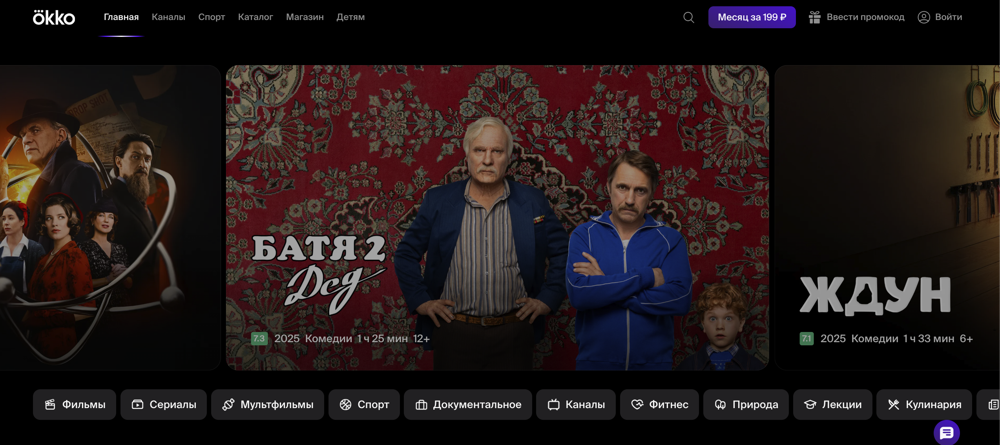
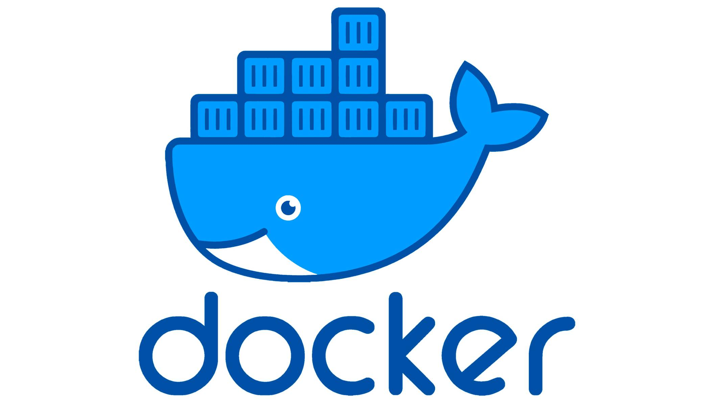
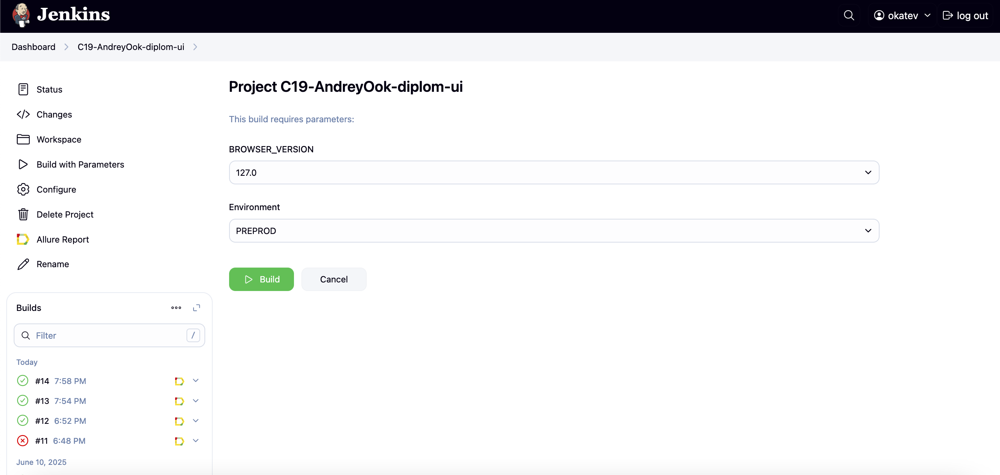
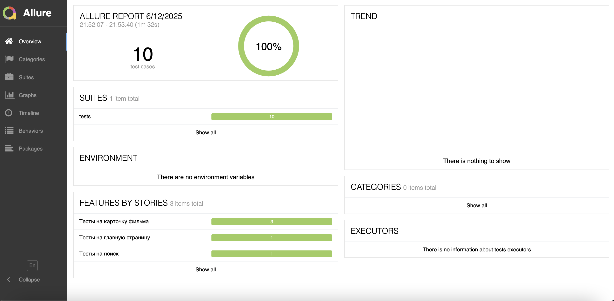
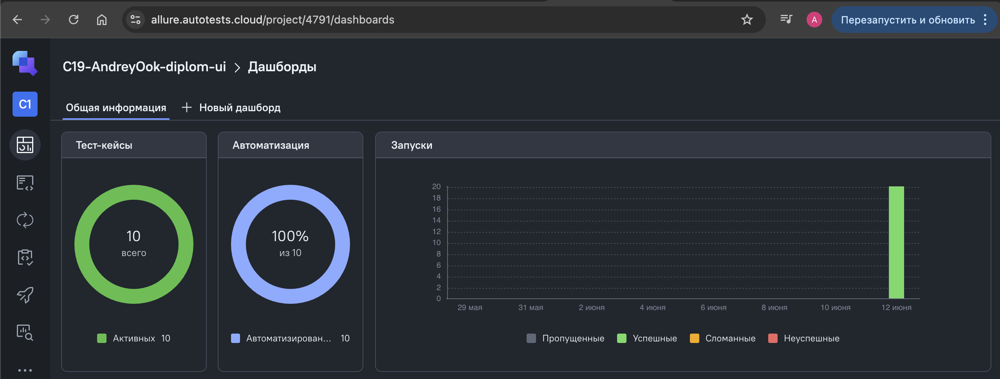
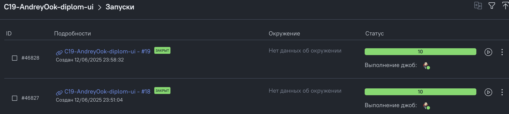
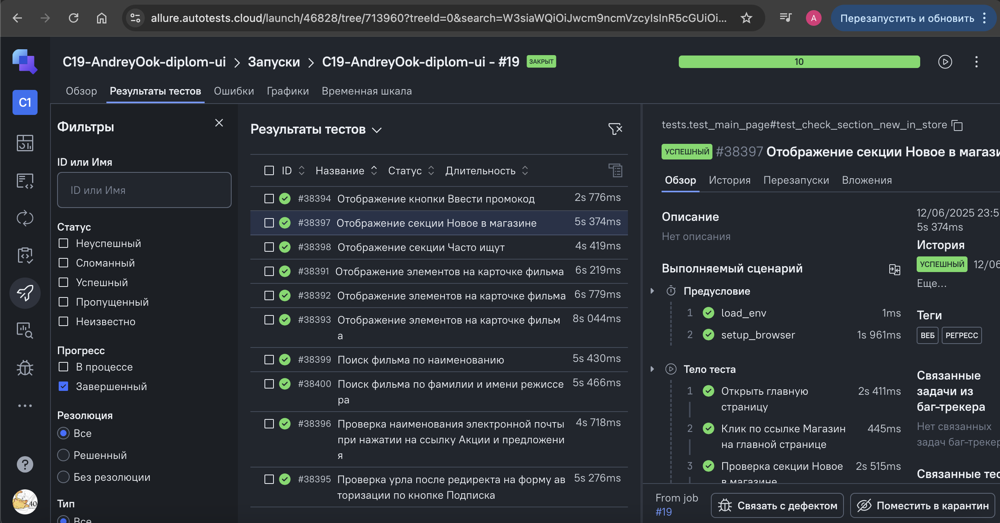
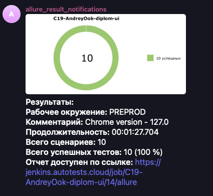
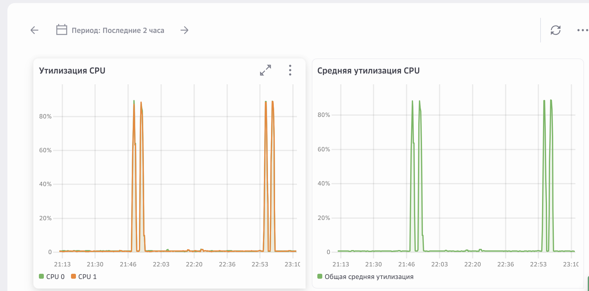
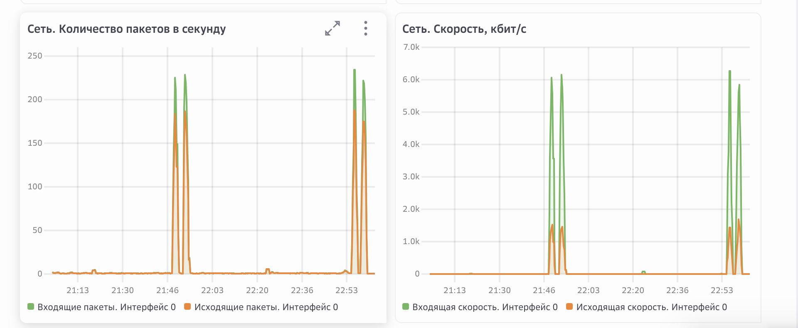

# Пример проекта автотестов для онлан-кинотеатра [Okko.tv](https://okko.tv/)
>Окко - российский онлайн-кинотеатр, позволяющий смотреть фильмы и телевизионные сериалы различных жанров в высоком качестве.
>Среди возможностей сервиса выделяются следующие:
>1) ТВ-каналы: Okko предлагает около 20 основных и десятков дополнительных эфирных каналов.
>2) Раздел «Спорт»: просмотр футбольных матчей, баскетбольных турниров, хоккея, биатлона, боёв МMA и даже киберспорта (например, Counter Strike 2 и Dota 2).
>4) Детский профиль: предусмотрена фильтрация контента по возрастному принципу, позволяющая подобрать подходящие материалы для детей.
>5) Мультипрофиль: возможность создать отдельные аккаунты для каждого члена семьи, добавив до пяти индивидуальных профилей с собственной историей просмотров.





###  Используемые технологии
<p align="center">
  <code></code>
  <code></code>
  <code></code>
  <code></code>
  <code></code>
  <code></code>
  <code></code>
  <code></code>
  <code></code>
  <code></code>
</p>

## Покрываемый функционал
✅ Главная страница:
- [x] Наличие секции по вводу промокода;
- [x] Проверка наименования почты в разделе акций;
- [x] Наличие секции "Новые фильмы" в разделе "Магазин";
- [x] Проверка урла после редиректа по кнопке "Подписка";
  
✅ Карточка фильма:
- [x] Наличие кнопки "Купить";
- [x] Отображение плеера при просмотре трейлера;
- [x] Оценка фильма незарегистрированным пользователем;
  
✅ Поиск фильмов:
- [x] Отображение на странице поиска секции "Часто ищут";
- [x] Поиск фильма по наименованию;
- [x] Поиск фильма по фамилии и имени режиссера;

## Запуск тестов
#### Тесты запускаются в Jenkins (инфраструктура qa-guru). Selenoid развернут в докер-контейнере. Докер поднят на вирутальной машине сервиса https://cloud.ru/

### Локально
Перед запуском нужно создать файл .env и указать там login, password и url для selenoid 


Для запуска тестов локально, нужно выполнить следующие шаги
1. Склонировать репозиторий
2. Открыть проект в PyCharm
3. Ввести в териминале следующие команды
``` 
python -m venv .venv
source .venv/bin/activate
pip install -r requirements.txt
context=web pytest -m web  
```

### С помощью [Jenkins](https://jenkins.autotests.cloud/job/C19-AndreyOok-diplom-ui/)
#### Для запуска автотестов необходимо:
 - Открыть [джобу](https://jenkins.autotests.cloud/job/C19-AndreyOok-diplom-ui/) в jenkins
 - Нажать на кнопку Build with Parameters
 - Выбрать версию хрома
 - Выбрать окружение, где будут исполняться тесты
 - Нажать на Build



## Отчет о прохождении тестов (Allure)
### Локально
Для получения отчета нужно ввести команду 
```
allure serve tests/allure-results
``` 
Ниже представлен пример allure отчета 


Подробные инструкции по работе с allure можно найти по [ссылке](https://allurereport.org/docs/)..
### Если тесты запускались в Jenkins

Для получения отчета нужно нажать на иконку allure report'a в строке билда  
У него будет точно такой же формат, как и при получении локально


### В проекте реализована интеграция с Allure TestsOps. Проект в TestOps можно найти по [ссылке](https://allure.autotests.cloud/project/4791/dashboards).




### В проекте настроена отправка краткого отчета в Telegram


#### Нагрузка виртуальной машины (vCPU=2, RAM=4) во время прогона тест-кейсов:



